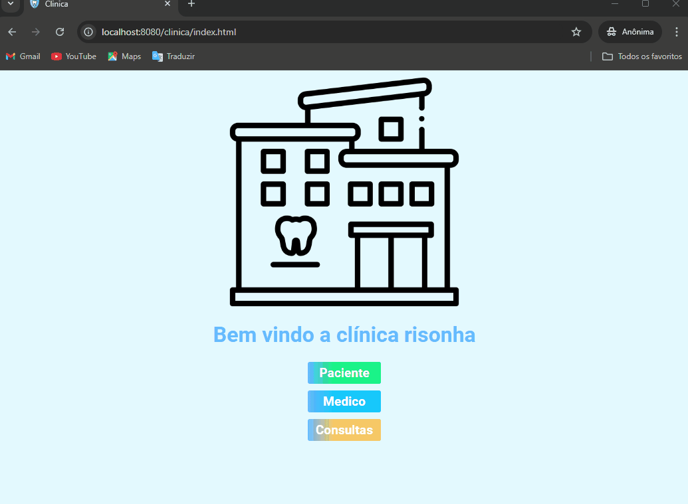

<h1 align="center">✨ Trabalho Prático de Desenvolvimento Web com Java, JDBC e MySQL ✨</h1>

<div align="center">
	
</div>

<p align="center">
  

  

  
 
</p>

<p align="center">
  <a href="#objetivo">Objetivo</a> &#xa0; | &#xa0; 
  <a href="#📽️Projeto">Projeto</a> &#xa0; | &#xa0;
  <a href="#funcionalidades">Funcionalidades</a> &#xa0; | &#xa0;
  <a href="#manual">Manual</a> &#xa0; | &#xa0;
  <a href="#detalhamento">Detalhamento</a> &#xa0; | &#xa0;
  <a href="https://github.com/Mathbull" target="_blank">Autor</a>
</p>

# 🎯Objetivo
O objetivo deste trabalho é aplicar os conceitos de desenvolvimento web utilizando Java, Servlets, DTOs, JDBC e MySQL para a construção de uma aplicação completa que permita a criação, leitura, atualização e exclusão de registros em um banco de dados relacional. A aplicação também deverá utilizar JSP ou JSTL para a camada de apresentação.

## 📽️Projeto
### 🦷Gerenciamento de Clínica Odontológica

Foi realizada uma aplicação web para uma clínica odontológica, com o objetivo de auxiliar no gerenciamento de entradas e saídas de pacientes e médicos, bem como no agendamento de consultas.

### ⚙️Funcionalidades

**Paciente:**  
* Cadastro de pacientes: (nome*, CPF*, telefone* e e-mail);
* Excluir pacientes: (exige confirmação de exclusão);
* Edição de dados cadastrados: (todos os campos podem ser editados);
* Leitura de pacientes cadastrados;
* OBS.: CPF, além de ser obrigatório, é único.

**Médico:**  
* Cadastro de médicos: (nome*, CRM* único, telefone* e e-mail);
* Excluir médicos: (exige confirmação de exclusão);
* Edição de dados cadastrados: (todos os campos podem ser editados);
* Leitura de médicos cadastrados;
* OBS.: CRM, além de ser obrigatório, é único.

**Consulta:**  
* Criação de novas consultas: (relacionando um paciente* a um médico* e data da consulta*);
* Excluir consultas;
* Edição de dados de consultas;
* Leitura de consultas já criadas.

**Extra:**  
* Paginação: Nav bar (Home, Paciente, Médico e Consulta);
* Validação de campo: verifica se os campos obrigatórios foram preenchidos;
* Feedback visual: mensagem de sucesso/erro no CRUD.

### 🛠️ Tecnologias utilizadas
Foi utilizado o **Eclipse** como IDE, com o módulo Java Web Developer, por ser voltado à programação full-stack e oferecer o **Dynamic Web Project**, que facilita o desenvolvimento web fornecendo uma estrutura pronta. Como servidor, foi usado o **Tomcat**.

**Back-end:**  
No back-end, foi utilizado Java, com o padrão de projeto **MVC** (Model-View-Controller). Na camada de **Controller**, usamos **Servlets** para o controle de fluxos de requisições, como redirecionar o usuário para alguma view ou buscar informações no banco de dados. Na camada de **Model**, utilizamos o banco de dados **MySQL** e o padrão **DAO** (Data Access Object) com **JDBC** para realizar a conexão e executar as queries. Para transferir dados do banco para a aplicação e vice-versa, usamos **DTO** (Data Transfer Objects).

**Front-end:**  
Na camada **View** do MVC, usamos **JSP** contendo HTML, CSS para estilização e JavaScript para validação de campos e envio de informações ao back-end.

### 🚧 Principais dificuldades encontradas
* O Visual Studio Code não permite a criação de um Dynamic Web Project, dificultando o uso desse editor.
* Esconder as informações da URL foi um desafio, pois pode representar um risco de segurança.
* Na página de edição de consulta, foi difícil filtrar e exibir apenas os dados específicos selecionados.

### 📂 SQL utilizado

<details>
    <summary>Exibir SQL</summary>

```sql  

    create database DBclinica;
use DBclinica;

/*------------------------------------- PACIENTES ---------------------------------------------------*/
create table pacientes(
	id int primary key auto_increment not null,
    cpf varchar(20) not null unique,
    nome varchar(250) not null,
    phone varchar(50) not null,
    email varchar(50)
);

describe pacientes;

/* CRUD - READ */
SELECT * FROM pacientes order by nome;

/* CRUD - CREATE */
INSERT INTO pacientes(cpf, nome, phone, email) values('9583015849264', 'Platao da Grecia', '1221548-1548', 'plataozin@gmail.com');

/* CRUD UPDATE */
update pacientes set nome='Silas' where id=10; 
update pacientes SET cpf='123', nome='MM', phone='123', email='' WHERE id=12 ;

/* CRUD - DELETE*/
DELETE FROM pacientes where id=1;

/*----------------------------------------- MEDICOS --------------------------------------------------*/
create table medicos(
	id int primary key auto_increment,
    crm varchar(20) not null unique,
    nome varchar(250) not null,
    phone varchar(50) not null,
    email varchar(50) 
);

describe medicos;

/* CRUD - READ */
SELECT * FROM medicos order by nome;

/* CRUD - CREATE */
INSERT INTO medicos(crm, nome, phone, email) values('9583015849264', 'Dr. Garvia', '1221548-1548', 'Garcia@gmail.com');

/* CRUD - UPDATE */
UPDATE medicos SET crm='', nome='', phone='', email='' WHERE id=1 ;

/* CRUD - DELETE */
DELETE FROM medicos where id=1;

/*------------------------------------------- CONSULTA ------------------------------------------------*/
create table consultas(
	id int primary key auto_increment,
    id_paciente int,
    id_medico int,
    data_consulta date not null,
    foreign key (id_paciente) references pacientes(id),
    foreign key (id_medico) references medicos(id)
);

describe consultas;

/* CRUD - READ */
SELECT * FROM consultas order by data_consulta;

SELECT cst.*, pct.nome, mdc.nome FROM consultas cst
LEFT JOIN pacientes pct ON cst.id_paciente = pct.id
LEFT JOIN medicos mdc ON cst.id_medico = mdc.id;

/* CRUD - CREATE */	
INSERT INTO consultas(id_paciente, id_medico, data_consulta ) values('12', '1', '2024-10-10');

/* CRUD - UPDATE */
update pacientes set nome='Silas' where id=10; 
update pacientes SET cpf='123', nome='MM', phone='123', email='' WHERE id=12 ;

/* CRUD - DELETE */
DELETE FROM consultas where id=1;

```

</details>

## 📖 Manual de execução

**Banco de Dados - MySQL**

É crucial para a execução ter instalado MySQL Workbench 8.4. Porteriormente a isso, anotar o nome de usuario e senha para serem usados no JDBC. Execulte o script SQL para criar os bancos de dados.

**Servidor - TomCat**

Feito isso, é importantater baixar e instalar o servidor TomCat, que sera nosso servidor.

**IDE - Eclipse for Java and Web Developer**

Cole os arquivos do projeto no workspace do Eclipse, configure o servidor e execute. 

Com esses passos é possivel que já esteja tudo funcionando.


## 📜 Detalhamento da constroção do app

Confira o seguinte <a href="detalhamento do projeto.md">link</a> para um detalhamento completo para o funcionamento completo da aplicação. O guia visa abranger desde o back-end até o front-end.

## :memo: Licença

Este projeto está sob licença MIT. Veja o arquivo [LICENSE](LICENSE) para mais detalhes.

<p align="center">Feito com 🫀 por <a href="https://github.com/Mathbull" target="_blank">Matheus Santos</a></p>


